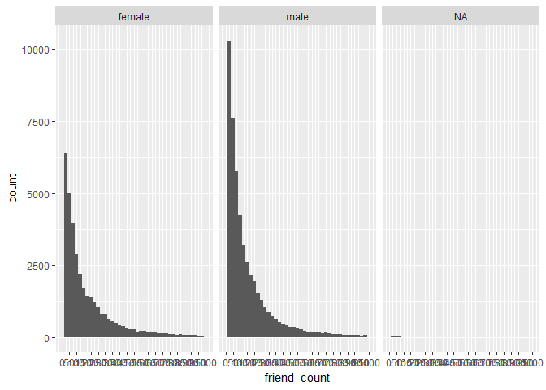
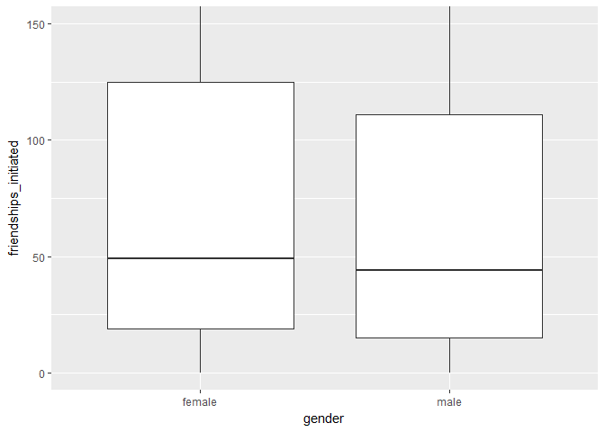

Udacity's Pseudo Facebook Data  

========================================================

***
### What is EDA?
Exploratory Data Analysis is an opportunity to let the data surprise you. Posing questions,trying to answer those questions with the available data,showing the results graphically and giving suggestions for improvement.

***
### Pseudo-Facebook User Data
**Note:** This is a curated Facebook data set by Udacity.
I hold no rights to the dataset.
Everything in this is done during the course of my study with Udacity.

***
### Loading  the Dataset

```r
pf<-read.csv("pseudo_facebook.tsv",sep='\t')
names(pf)
```

```
##  [1] "userid"                "age"                  
##  [3] "dob_day"               "dob_year"             
##  [5] "dob_month"             "gender"               
##  [7] "tenure"                "friend_count"         
##  [9] "friendships_initiated" "likes"                
## [11] "likes_received"        "mobile_likes"         
## [13] "mobile_likes_received" "www_likes"            
## [15] "www_likes_received"
```
There are 15 columns(variables) in the data set.

***
### Finding the number of users' birthdays on different days.
First, the package('ggplot2') is installed and loaded and then the plotting is done.

```r
install.packages("ggplot2", repos = "http://cran.us.r-project.org")
```

```
## Installing package into 'C:/Users/Jon Targaryen/Documents/R/win-library/3.4'
## (as 'lib' is unspecified)
```

```
## package 'ggplot2' successfully unpacked and MD5 sums checked
## 
## The downloaded binary packages are in
## 	C:\Users\Jon Targaryen\AppData\Local\Temp\RtmpUNRRXC\downloaded_packages
```

```r
library(ggplot2)

qplot(x=dob_day, data =pf) +
  scale_x_continuous(breaks=1:31)
```

```
## `stat_bin()` using `bins = 30`. Pick better value with `binwidth`.
```

<!-- -->

### What are some things that you notice about this histogram?
**Response:**On the first day of the month , there is a huge bin of almost 8,000 people. This seems unusual. Let's try sorting this.

***
### Faceting : Breaking the previous histogram into 12 histograms,i.e one for each month of the year.


```r
qplot(x=dob_day, data =pf) +
  scale_x_continuous(breaks=1:31)+
  facet_wrap(~dob_month,ncol=3)
```

```
## `stat_bin()` using `bins = 30`. Pick better value with `binwidth`.
```

<!-- -->

### What stands out here?
**Response:** There are some peaks in some months like May and October(i.e 5 and 10) , but there is a huge peak on January 1st ( i.e 1 ) almost 4000 users.
This could be because of the default settings that Facebook uses or perhaps users are choosing the first choice in the drop down menu.

Another possibilty can be that users might want to protect their privacy and so they go with the default settings.

***
### Find the friend counts


```r
qplot(x=friend_count,data=pf)
```

```
## `stat_bin()` using `bins = 30`. Pick better value with `binwidth`.
```

<!-- -->

**Response:** The data is squished on the left hand side of the graph and the graph extends all the way to the 50000 mark on y-axis.

This is a long-tail data.

Here, there are a few users with really high values of friends.
I will try having a look at the bulk of the data which in this case is somewhere below 1000 which is on x-axis.

***
### Limiting the Axes
Notes: To get information about the bulk of the data , which in this case , is x values under 1000, I am going to limit the axis.


```r
qplot(x=friend_count,data=pf,xlim=c(0,1000))
```

```
## `stat_bin()` using `bins = 30`. Pick better value with `binwidth`.
```

```
## Warning: Removed 2951 rows containing non-finite values (stat_bin).
```

<!-- -->

Another useful way to vary the x limits : 

```r
qplot(x=friend_count,data=pf)+
  scale_x_continuous(limits=c(0,1000))
```

```
## `stat_bin()` using `bins = 30`. Pick better value with `binwidth`.
```

```
## Warning: Removed 2951 rows containing non-finite values (stat_bin).
```

<!-- -->


### Adjusting the Bin Width : Let's vary the binwidth

```r
qplot(x=friend_count,data=pf,binwidth= 25)+
  scale_x_continuous(limits = c(0,1000),breaks=seq(0,1000,50))
```

```
## Warning: Removed 2951 rows containing non-finite values (stat_bin).
```

<!-- -->

**Response**: The graph shows that many users have less than 25 friends . These users are probably new.

***
### Which gender has more friends?
Faceting Friend Count

```r
qplot(x = friend_count, data = pf, binwidth = 25) +
  scale_x_continuous(limits = c(0, 1000),breaks = seq(0, 1000, 50))+
  facet_wrap(~gender)
```

```
## Warning: Removed 2951 rows containing non-finite values (stat_bin).
```

<!-- -->

**Response** : Here , there is a third graph which was unexpected. This refers to the "NA" (Not Available) values. i.e the missing data. Let's remove these misssing values.

***
### Omitting NA Values
Notes: There is a graph for "NA" values. Next step is to remove these NA values from the variable.

I will take the subset of our data with the NA values removed.


```r
qplot(x = friend_count, data = subset(pf,!is.na(gender)), binwidth = 10) +
  scale_x_continuous(limits = c(0, 1000),breaks = seq(0, 1000, 50))+
  facet_wrap(~gender)
```

```
## Warning: Removed 2949 rows containing non-finite values (stat_bin).
```

<!-- -->

**Response** :The "NA" values have been removed by the subset function on data as seen above and the graph is plotted.

***
###Finding friend counts by Gender
Notes: Let's find the friend counts based on gender.


```r
summary((pf$gender))
```

```
## female   male   NA's 
##  40254  58574    175
```
**Response**: There are more males than females in the dataset.

### Average friend count by gender

```r
by(pf$friend_count,pf$gender,summary)
```

```
## pf$gender: female
##    Min. 1st Qu.  Median    Mean 3rd Qu.    Max. 
##       0      37      96     242     244    4923 
## -------------------------------------------------------- 
## pf$gender: male
##    Min. 1st Qu.  Median    Mean 3rd Qu.    Max. 
##       0      27      74     165     182    4917
```

### Who on average has more friends: men or women?
**Response:** Female uers have more friends on average

### What's the difference between the median friend count for women and men?
**Response:** 96 - 74 = 22

### Why would the median be a better measure than the mean?
**Response:** Notice that the mean for friend count is higher than the median for both males and females.
This can be adhered to the fact that our data was long tailed.

So the higher values in the friend count will pull the mean to the right .

The median is a better measure than mean beacause its a more robust statistic.
A few people with huge friends count drag the mean to the right i.e upwards , which isn't necessarily the correct representative of the most users in this study.

Median is resistant to such changess since it marks the halfway point for all the datap points.

Hence, Median is a better measure than mean.

***
### Finding the distribution of "Tenure" i.e how many days someone has been using Facebook.


```r
qplot(x=tenure, data=pf,binwidth=30,
      color=I('black'),fill=I('#099DD9'))
```

```
## Warning: Removed 2 rows containing non-finite values (stat_bin).
```

<!-- -->

**Response:** Binwidth value is 30 here since the measurement here is days and 30 days is about a month.

### Finding tenure by year.


```r
qplot(x=tenure/365, data=pf,binwidth=0.25,
      color=I('black'),fill=I('#F79420'))+
  scale_x_continuous(limits = c(0,7),breaks = seq(1,7,1))
```

```
## Warning: Removed 26 rows containing non-finite values (stat_bin).
```

<!-- -->

**Response:** Bulk of users have been less than 2-3 years on facebook.

### Labeling Plots
Notes: Proper labelling to axes.


```r
qplot(x=tenure/365, data=pf,binwidth=0.25,
      xlab='Number of years using Facebook',
      ylab='Number of users in sample',
      color=I('black'),fill=I('#F79420'))+
  scale_x_continuous(limits = c(0,7),breaks = seq(1,7,1))
```

```
## Warning: Removed 26 rows containing non-finite values (stat_bin).
```

<!-- -->

***
###Findings with facebook users based on their age.


```r
summary(pf$age)
```

```
##    Min. 1st Qu.  Median    Mean 3rd Qu.    Max. 
##   13.00   20.00   28.00   37.28   50.00  113.00
```

```r
qplot(x=age,data=pf,binwidth=1,
      color=I('black'),fill=I('#5760AB'))+
  scale_x_continuous(breaks=seq(0,113,5))
```

<!-- -->

**Response:** The large spikes are in mid to late 20's.
No users to the left of 13. This makes sense because users have to be a minimum age of atleast 13 to set up a facebook account.  

There are also unusual spikes above 100 which might not be possible. May be some users are just exaggerating their age.


***
###Transforming Data.

Notes: Sometimes its good to use different scales to understand the data.

```r
qplot(x=friend_count,data=pf)
```

```
## `stat_bin()` using `bins = 30`. Pick better value with `binwidth`.
```

<!-- -->

```r
summary(pf$friend_count)
```

```
##    Min. 1st Qu.  Median    Mean 3rd Qu.    Max. 
##     0.0    31.0    82.0   196.4   206.0  4923.0
```

```r
summary(log10(pf$friend_count))
```

```
##    Min. 1st Qu.  Median    Mean 3rd Qu.    Max. 
##    -Inf   1.491   1.914    -Inf   2.314   3.692
```

```r
summary(log10(pf$friend_count+1)) # +1 to avoid log10(0) which is infinity
```

```
##    Min. 1st Qu.  Median    Mean 3rd Qu.    Max. 
##   0.000   1.505   1.919   1.868   2.316   3.692
```

```r
summary(sqrt(pf$friend_count))
```

```
##    Min. 1st Qu.  Median    Mean 3rd Qu.    Max. 
##   0.000   5.568   9.055  11.088  14.353  70.164
```

```r
install.packages("gridExtra",repos = "http://cran.us.r-project.org")
```

```
## Installing package into 'C:/Users/Jon Targaryen/Documents/R/win-library/3.4'
## (as 'lib' is unspecified)
```

```
## package 'gridExtra' successfully unpacked and MD5 sums checked
## 
## The downloaded binary packages are in
## 	C:\Users\Jon Targaryen\AppData\Local\Temp\RtmpUNRRXC\downloaded_packages
```

```r
library(gridExtra)

p1<-qplot(x=friend_count,data=pf)
p2<-qplot(x=log10(friend_count+1),data=pf)
p3<-qplot(x=sqrt(friend_count),data=pf)

grid.arrange(p1,p2,p3,ncol=1)
```

```
## `stat_bin()` using `bins = 30`. Pick better value with `binwidth`.
## `stat_bin()` using `bins = 30`. Pick better value with `binwidth`.
## `stat_bin()` using `bins = 30`. Pick better value with `binwidth`.
```

<!-- -->

**Response**: Different scales are plotted and the 3 graphs are plotted together with a new package "gridExtra".

### Scales different syntax

```r
p1<-ggplot(aes(x=friend_count),data=pf)+ geom_histogram()
p2<-p1 + scale_x_log10()
p3<-p1 + scale_x_sqrt()

grid.arrange(p1,p2,p3,ncol=1)
```

```
## `stat_bin()` using `bins = 30`. Pick better value with `binwidth`.
```

```
## Warning: Transformation introduced infinite values in continuous x-axis
```

```
## `stat_bin()` using `bins = 30`. Pick better value with `binwidth`.
```

```
## Warning: Removed 1962 rows containing non-finite values (stat_bin).
```

```
## `stat_bin()` using `bins = 30`. Pick better value with `binwidth`.
```

<!-- -->

***

### Adding a Scaling Layer
Notes:


```r
logScale<-qplot(x=log10(friend_count),data=pf)

countScale<-ggplot(aes(x=friend_count),data=pf)+
  geom_histogram()+
  scale_x_log10()

grid.arrange(logScale,countScale,ncol=1)
```

```
## `stat_bin()` using `bins = 30`. Pick better value with `binwidth`.
```

```
## Warning: Removed 1962 rows containing non-finite values (stat_bin).
```

```
## Warning: Transformation introduced infinite values in continuous x-axis
```

```
## `stat_bin()` using `bins = 30`. Pick better value with `binwidth`.
```

```
## Warning: Removed 1962 rows containing non-finite values (stat_bin).
```

<!-- -->

**Respone:** We can see that the labelling here is different for the two plots.
Using "scale_x_log10" ((the countScale plot i.e plot 2)) will label the axis in actual friend counts.
Using the log 10 wrapper will label x asis in log 10 units.


***
### Frequency Polygons
These let us compare distributions.
They draw a curve connecting the counts of histogram.


```r
qplot(x=friend_count,data=subset(pf,!is.na(gender)),binwidth=10)+
  scale_x_continuous(lim=c(0,1000),breaks=seq(0,1000,50))+
  facet_wrap(~gender)
```

```
## Warning: Removed 2949 rows containing non-finite values (stat_bin).
```

<!-- -->

```r
qplot(x=friend_count,data=subset(pf,!is.na(gender)),
      binwidth=10,geom='freqpoly',color=gender)+
  scale_x_continuous(lim=c(0,1000),breaks=seq(0,1000,50))
```

```
## Warning: Removed 2949 rows containing non-finite values (stat_bin).
```

```
## Warning: Removed 4 rows containing missing values (geom_path).
```

<!-- -->

```r
qplot(x=friend_count,y= ..count../sum(..count..),
      data=subset(pf,!is.na(gender)),
      xlab='Friend Count',
      ylab='Proportion of users with that friend count',
      binwidth=10,geom='freqpoly',color=gender)+
  scale_x_continuous(lim=c(0,1000),breaks=seq(0,1000,50))
```

```
## Warning: Removed 2949 rows containing non-finite values (stat_bin).

## Warning: Removed 4 rows containing missing values (geom_path).
```

<!-- -->

```r
by(pf$friend_count,pf$gender,summary)
```

```
## pf$gender: female
##    Min. 1st Qu.  Median    Mean 3rd Qu.    Max. 
##       0      37      96     242     244    4923 
## -------------------------------------------------------- 
## pf$gender: male
##    Min. 1st Qu.  Median    Mean 3rd Qu.    Max. 
##       0      27      74     165     182    4917
```


**Response :** Here, the y axis class is changed to get to know the average friend count.

While it may appear that the males have higer friend counts on average than women , we can see that many males or a high percentage of males have low friend count. Its probably in the tail region of  the graph where the females overtake men.

Hence, its always good to see the relations using the "by" function as above.

***
### Which gender creates more likes on the world wide web?


```r
qplot(x=www_likes,data=subset(pf,!is.na(gender)),
      geom='freqpoly',color=gender)+
  scale_x_log10()
```

```
## Warning: Transformation introduced infinite values in continuous x-axis
```

```
## `stat_bin()` using `bins = 30`. Pick better value with `binwidth`.
```

```
## Warning: Removed 60935 rows containing non-finite values (stat_bin).
```

<!-- -->

```r
by(pf$www_likes,pf$gender,sum)
```

```
## pf$gender: female
## [1] 3507665
## -------------------------------------------------------- 
## pf$gender: male
## [1] 1430175
```

**Response:** The females have more likes, almost 2.5 times more, when compared to the males.

***
### Box Plots: 
A Box plot helps in understanding the distribution of data , lets us know the 50 % values of each segment of categorical data and most importantly , lets us know about the outliers.


```r
qplot(y=friend_count,x=gender,data=subset(pf,!is.na(gender)),
      geom='boxplot')
```

<!-- -->

```r
qplot(y=friend_count,x=gender,data=subset(pf,!is.na(gender)),
      geom='boxplot')+
  scale_y_continuous(limits=c(0,1000))
```

```
## Warning: Removed 2949 rows containing non-finite values (stat_boxplot).
```

<!-- -->

```r
by(pf$friend_count,pf$gender,summary)
```

```
## pf$gender: female
##    Min. 1st Qu.  Median    Mean 3rd Qu.    Max. 
##       0      37      96     242     244    4923 
## -------------------------------------------------------- 
## pf$gender: male
##    Min. 1st Qu.  Median    Mean 3rd Qu.    Max. 
##       0      27      74     165     182    4917
```

**Response:** The scale_y_continuous or the ylim , will remove some data points.So the Q3 value might not exactly be near 250 as in females for example.
So instead, coord_cartesian must be used.


```r
qplot(y=friend_count,x=gender,data=subset(pf,!is.na(gender)),
      geom='boxplot')+
  coord_cartesian(ylim=c(0,250))
```

<!-- -->

```r
by(pf$friend_count,pf$gender,summary)
```

```
## pf$gender: female
##    Min. 1st Qu.  Median    Mean 3rd Qu.    Max. 
##       0      37      96     242     244    4923 
## -------------------------------------------------------- 
## pf$gender: male
##    Min. 1st Qu.  Median    Mean 3rd Qu.    Max. 
##       0      27      74     165     182    4917
```

**Response :** As seen from the box plot and the "by" function: the median is more for females than males. 
Hence, coord_cartesian is a better way for the box plots.

***
### Friendships initiated findings

```r
qplot(x=gender,y=friendships_initiated,
      data=subset(pf,!is.na(gender)),
      geom = 'boxplot')+
  coord_cartesian(ylim=c(0,150))
```

<!-- -->

### On average, who initiated more friendships in our sample: men or women?

**Response:** The medians are close. But still , there is a slight higher value in the friendships initiated for females.

### Write about some ways that you can verify your answer.


```r
by(pf$friendships_initiated,pf$gender,summary)
```

```
## pf$gender: female
##    Min. 1st Qu.  Median    Mean 3rd Qu.    Max. 
##     0.0    19.0    49.0   113.9   124.8  3654.0 
## -------------------------------------------------------- 
## pf$gender: male
##    Min. 1st Qu.  Median    Mean 3rd Qu.    Max. 
##     0.0    15.0    44.0   103.1   111.0  4144.0
```

**Response:** The values show that the Median is slightly more for females than males as shown in the box plot too.
Hence, females get more friendship requests than males.

***

### Getting Logical
Notes: Sometimes there will be variables that have lots of zero entries . These can be converted to a new binary variable that has only TRUE or FALSE.
This is helpful because we may want to know whether a user has used a certain feature at all, instead of the number of times the user has actually used that feature.


```r
summary(pf$mobile_likes)
```

```
##    Min. 1st Qu.  Median    Mean 3rd Qu.    Max. 
##     0.0     0.0     4.0   106.1    46.0 25111.0
```

**Response :** The Median is 4.0 which means there are lots of zero value entries.


```r
summary(pf$mobile_likes>0)
```

```
##    Mode   FALSE    TRUE 
## logical   35056   63947
```
**Response: ** Here , I used the comparison operator, greater than( > ) . Hence, the result is TRUE for the entries where this condition is satisfied , and FALSE when the condition isn't satisfied.

###Creating new variable with logical condition

```r
mobile_check_in<-NA

#assigning 1 to mobile checkin , 0 if not checked in via mobile
pf$mobile_check_in<-ifelse(pf$mobile_likes>0,1,0)

summary(pf$mobile_check_in)
```

```
##    Min. 1st Qu.  Median    Mean 3rd Qu.    Max. 
##  0.0000  0.0000  1.0000  0.6459  1.0000  1.0000
```

```r
pf$mobile_check_in<-factor(pf$mobile_check_in)
summary(pf$mobile_check_in)
```

```
##     0     1 
## 35056 63947
```

### What percent check in using mobile?

```r
sum(pf$mobile_check_in==1)/length(pf$mobile_check_in)
```

```
## [1] 0.6459097
```

**Response:** Thats 65 % .

So it would make a whole lot of sense to increase or develop mobile side of usage of facebook since so many users have used facebook on mobile.
Atleast, thats what we can conclude with the given data set which we worked on.

***
